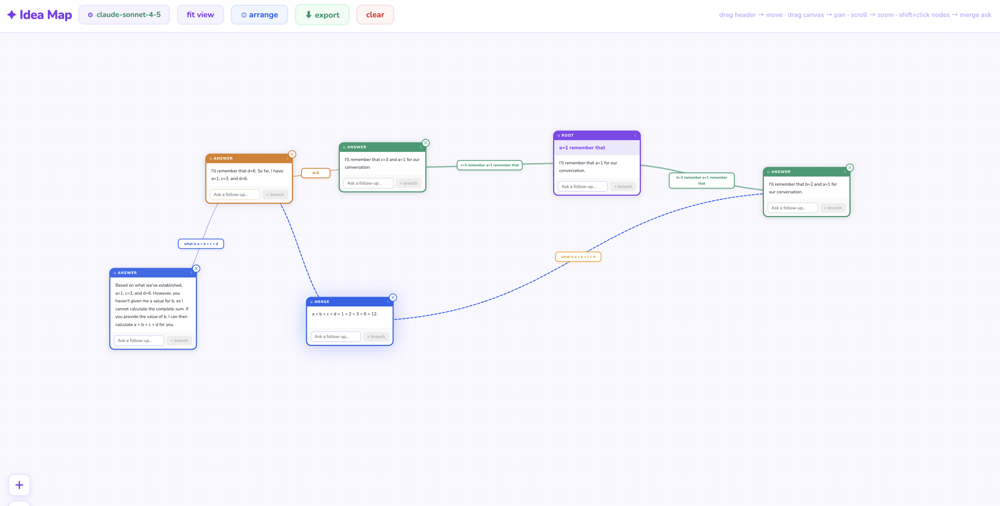

# ✦ Claude Idea Map

A Q&A-driven idea map. Each node shows your question and Claude's answer.
Branch from any node to go deeper — the full ancestor chain becomes context for every new question.



## Structure

```
ideamap/
├── backend/       Express server — proxies Anthropic API (no CORS issues)
│   └── server.js
└── frontend/      React + Vite UI
    └── src/App.jsx
```

## Setup

### 1. Backend

```bash
cd backend
npm install
node server.js
# Runs on http://localhost:3001
```

### 2. Frontend (new terminal)

```bash
cd frontend
npm install
npm run dev
# Opens http://localhost:3000
```

### 3. Use it

1. Open http://localhost:3000
2. Paste your `sk-ant-...` API key (saved in browser for convenience)
3. Type your first question → **Start →**
4. Read Claude's answer in the bottom half of the node
5. Type a follow-up in the input at the bottom of any node → **+ node**
6. That creates a child node with your question as context
7. Drill as deep as you want — every node knows its full ancestor chain

## How context works

When you ask a question at level 3, the backend receives:

- Level 0: root question + answer
- Level 1: question + answer
- Level 2: question + answer
- Level 3: your new question

Claude sees the full learning journey, so answers stay precise and relevant.

## Controls

| Action        | How                        |
| ------------- | -------------------------- |
| Pan           | Drag the canvas background |
| Zoom          | Scroll wheel               |
| Fit all nodes | "fit view" button          |
| Delete branch | ✕ on any node              |
| Reset map     | "clear" button             |
